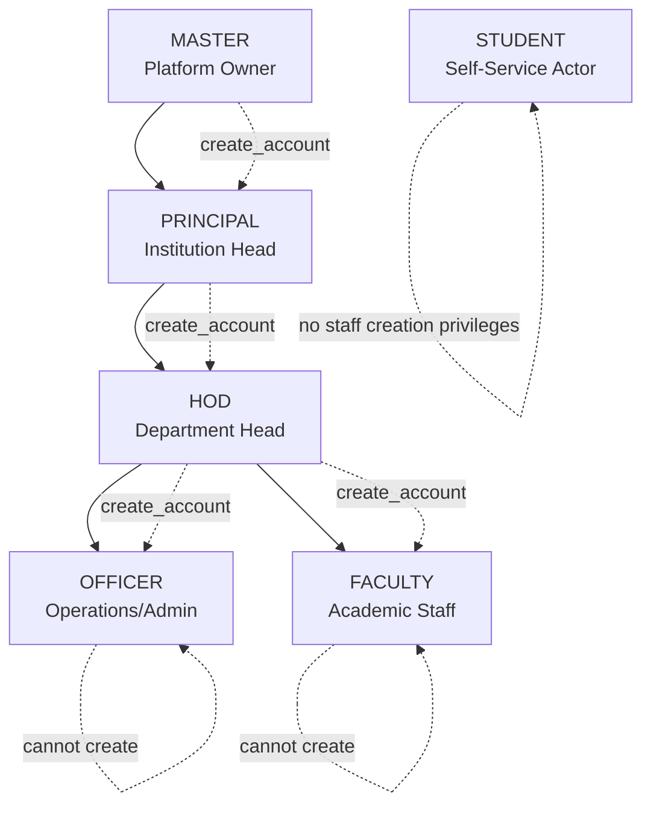
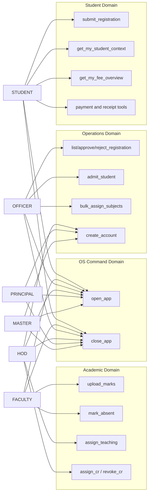
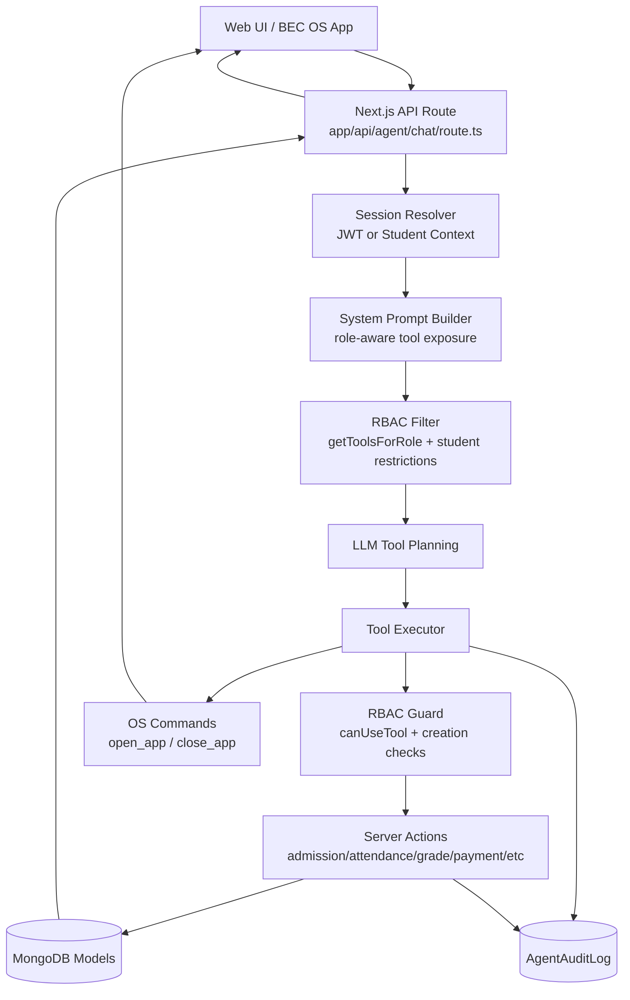
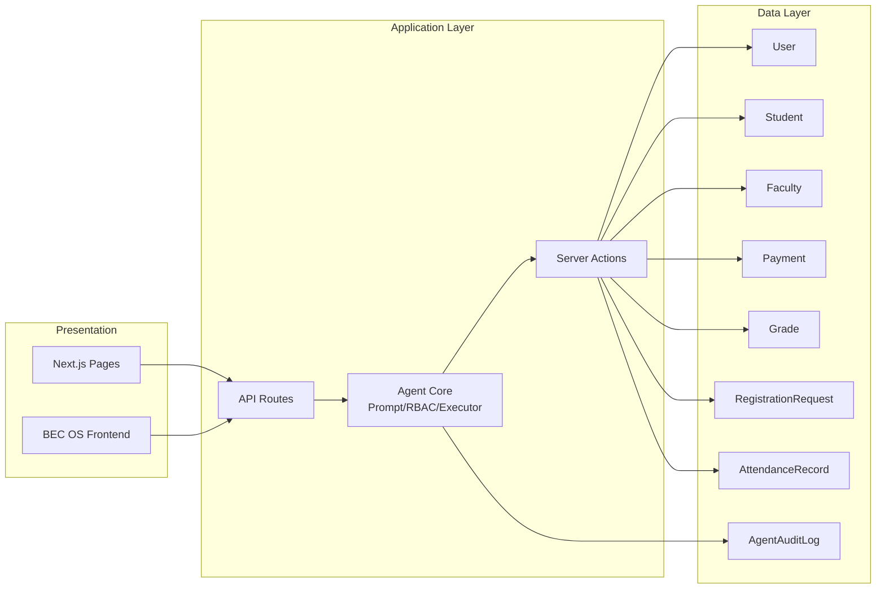

# Role-Based Hierarchy System Design and System Architecture

This document captures the role hierarchy, permission boundaries, and runtime architecture for the VORA/BEC platform.

## 1) Role Hierarchy Design (RBAC + Delegation)

### Analysis

- The hierarchy is a controlled delegation tree, not a full inheritance graph of unlimited permissions.
- Account creation is intentionally narrow:
  - MASTER can create PRINCIPAL.
  - PRINCIPAL can create HOD.
  - HOD can create OFFICER and FACULTY.
- OFFICER and FACULTY are same depth peers in authority level for account governance, reducing lateral privilege escalation.
- STUDENT is intentionally outside staff creation hierarchy and is scoped to self-service functions and app launching.

## 2) Capability Matrix by Role (Functional RBAC)

### Analysis

- Permissioning is capability-based and explicit per tool rather than implicit by hierarchy level.
- The model prevents over-entitlement:
  - Example: PRINCIPAL does not automatically gain FACULTY-only workflows unless explicitly assigned.
- Security benefit: reducing transitive permissions lowers blast radius during credential compromise.
- Operational benefit: role onboarding and audits map directly to tool lists, simplifying compliance checks.

## 3) Runtime System Architecture (Request to Action)

### Analysis

- Defense-in-depth is present at multiple layers:
  - Tool exposure filtering before the model plans calls.
  - Executor-level RBAC check before invocation.
  - Domain/server-action guards enforcing role requirements.
- This layered approach is resilient to prompt drift and malformed tool-call attempts.
- Audit logging at execution level creates forensic traceability for sensitive operations like admissions and account creation.
- STUDENT flow is additionally constrained to context-first response behavior and reduced tool access, lowering unnecessary write-path exposure.

## 4) Data and Control Boundaries

### Analysis

- Clean separation of concerns:
  - Presentation never writes directly to database.
  - Role checks are centralized before action execution.
  - Domain writes happen through action-specific services.
- AgentAuditLog sits as cross-cutting observability storage and should be retained with strict access policies.
- Indexing role + department in user data supports fast operational filtering and department-scoped governance.

## 5) Security and Scalability Recommendations

- Add policy versioning for RBAC snapshots so each audit record can reference the active policy state.
- Introduce deny-by-default policy tests for each tool on every role to prevent accidental permission expansion.
- Add department-aware constraints at tool layer for OFFICER workflows where business policy requires stricter scoping.
- Implement alerting on high-risk actions:
  - create_account
  - admit_student
  - bulk_assign_subjects
- For scale, isolate read-heavy student context and fee overview queries with caching while preserving strong consistency for write operations.

## 6) Summary

The architecture combines hierarchical account governance with capability-based tool authorization. This hybrid model avoids excessive privilege inheritance, supports clear operational boundaries, and provides strong auditability for institutional workflows.
